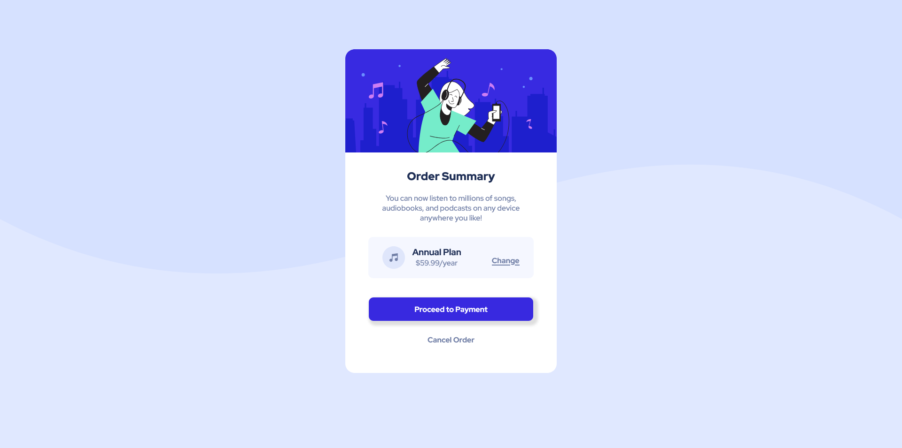

# Frontend Mentor - Order summary card solution

This is a solution to the [Order summary card challenge on Frontend Mentor](https://www.frontendmentor.io/challenges/order-summary-component-QlPmajDUj). Frontend Mentor challenges help you improve your coding skills by building realistic projects. 

## Table of contents

- [Overview](#overview)
  - [The challenge](#the-challenge)
  - [Screenshot](#screenshot)
  - [Links](#links)
- [My process](#my-process)
  - [Built with](#built-with)
  - [What I learned](#what-i-learned)
- [Author](#author)

## Overview

### The challenge

Recreate this design from Frontend Mentor as close as possible 

Users should be able to:

- See hover states for interactive elements

### Screenshot of Finished Solution

### Links

- Solution URL: [Github repository](https://github.com/maxmirav/order-summary-component-main)
- Live Site URL: [Live site hosted on Vercel](https://order-summary-component-main-murex.vercel.app/)

## My process

### Built with

- HTML
- CSS
- Flexbox
- And a whole lot of Googling

### What I learned

I learned a lot about Flexbox, mostly how to control Flex items using justify-content and align-items.

Things that were new to me:

- You can use CSS to add a shadow to div boxes (makes flat divs pop out).
- When using Google Fonts, you can use multiple font weights of the same font. Just click on the weights or styles that you want to incorporate in your project.

## Author

- Website - [Max Miravite](https://www.maxmirav.github.io)
- Frontend Mentor - [@maxmirav](https://www.frontendmentor.io/profile/maxmirav)
- Twitter - [@MaxMiravite](https://www.twitter.com/MaxMiravite)

